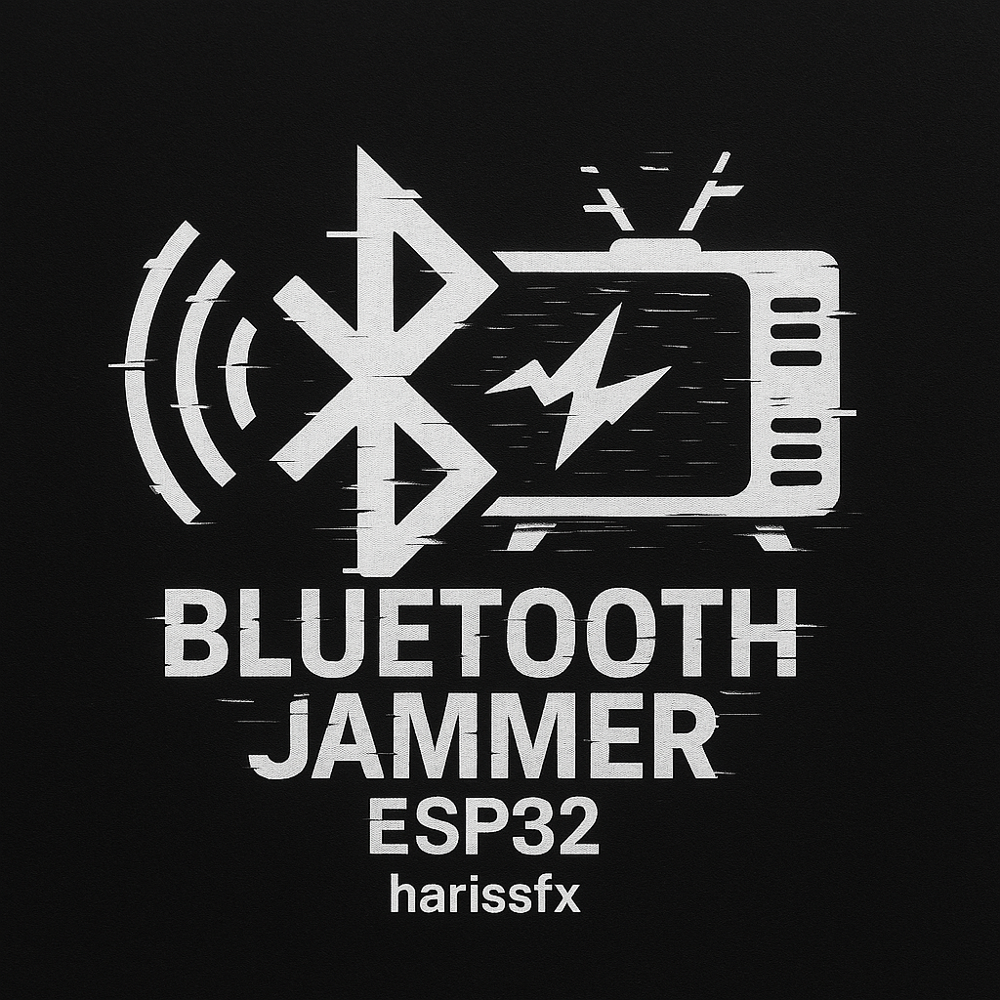

# Alat Jamming Wireless & Remote TV IR



## Sekilas Proyek

Proyek ini bikin alat pakai ESP32 yang punya 2 fungsi utama:
1. Bisa ngacak sinyal WiFi dan Bluetooth (jamming) pakai 2 modul RF
2. Bisa kirim kode remote TV universal via sinyal IR (infrared)

Cocok banget buat demonstrasi, belajar tentang sinyal, atau sekadar pengganti remote TV.

---

## Alat & Bahan yang Dibutuhin

### Daftar Komponen
- ESP32 Dev Board (saran: ESP32-WROOM-32)
- 2x Modul NRF24L01+ (transceiver 2.4GHz)
- LED IR (saran: ky 005)
- kapasitor 100kΩ atau 10kΩ 2x
- 1 Tombol tekan (push button)
- Breadboard atau PCB
- Sumber daya (bisa dari baterai LiPo atau colok USB)
- Kabel jumper secukupnya

### Rangkaian Koneksinya

### Koneksi Komponen ke ESP32

#### Modul NRF24L01+ #1 (pakai SPI default - VSPI)
| Pin NRF24L01+ | Pin ESP32 |
|---------------|-----------|
| CE            | GPIO16    |
| CSN           | GPIO15    |
| SCK           | GPIO14    |
| MISO          | GPIO12    |
| MOSI          | GPIO13    |

#### Modul NRF24L01+ #2 (pakai SPI alternatif - HSPI)
| Pin NRF24L01+ | Pin ESP32 |
|---------------|-----------|
| CE            | GPIO22    |
| CSN           | GPIO21    |
| SCK           | GPIO18    |
| MISO          | GPIO19    |
| MOSI          | GPIO23    |

#### Koneksi Tambahan
| Komponen         | Pin ESP32 |
|------------------|-----------|
| LED IR (ky 005) | GPIO25 |
| Tombol Toggle     | GPIO33   |


---

## Persiapan Software

### Library yang Dibutuhin
- RF24
- SPI
- ezButton
- IRremote
- tvbgone_codes.h (udah disertakan di proyek)

### Cara Setup

1. Download Arduino IDE dari [arduino.cc](https://www.arduino.cc/en/software)
2. Tambahkan dukungan board ESP32:
   - Buka Arduino IDE
   - Masuk ke **File > Preferences**
   - Tambahkan ini ke *Additional Board URLs*:  
     ```
     https://raw.githubusercontent.com/espressif/arduino-esp32/gh-pages/package_esp32_index.json
     ```
   - Buka **Tools > Board > Boards Manager**, cari **ESP32**, terus install

3. Install library:
   - Masuk ke **Sketch > Include Library > Manage Libraries**
   - Cari dan install: **RF24**, **ezButton**, **IRremote**

4. Ambil file `tvbgone_codes.h` dari repositori

5. Copy-paste kode utamanya ke Arduino IDE

6. Pilih board & port yang sesuai:
   - Board: **ESP32 Dev Module**
   - Port: (pilih port tempat ESP32 kamu terhubung)

7. Upload kodenya ke ESP32


Kalau gak mau ribet tinggal flash disini: https://harissfx.github.io/Blue-Jamming-Tv-Gone/
---

## Cara Pakainya

### Tombol & Fungsi

- **Tombol BOOT (GPIO0)**: Buat ganti mode antara Jamming dan IR Send
- **Tombol TOGGLE (GPIO33)**: Buat mulai/berhenti fungsi yang lagi aktif
- **LED Status**: Tanda-tanda mode
  - Kelap-kelip lambat: Standby
  - Nyala terus: Lagi jamming
  - Kelap-kelip cepat: Lagi kirim IR

---

### Mode Pengoperasian

#### Mode Jamming
Di mode ini:
- 2 modul NRF24L01+ bakal kirim sinyal acak di frekuensi 2.4GHz
- Sinyalnya lompat-lompat terus (frequency hopping)
- Bisa ganggu WiFi dan Bluetooth di sekitar

**Cara pakai:**
1. Nyalain alat (default-nya langsung masuk Jamming Mode)
2. Tekan tombol TOGGLE buat mulai jamming
3. Tekan TOGGLE lagi buat berhenti

#### Mode IR Remote
Di mode ini:
- Alat bakal kirim sinyal power on/off untuk hampir semua merek TV
- Bisa dipakai kayak remote universal

**Cara pakai:**
1. Nyalain alat
2. Tekan tombol BOOT buat pindah ke mode IR
3. Arahkan LED IR ke TV atau alat elektronik yang mau dikontrol
4. Tekan TOGGLE buat mulai kirim sinyal
5. Tekan TOGGLE lagi buat berhenti

---

## Info Teknis

### Tentang Jamming
- Pakai 2 modul RF sekaligus supaya jangkauan lebih luas
- Frekuensinya lompat-lompat biar lebih efektif
- ESP32 pakai 2 SPI channel yang berbeda (HSPI & VSPI)

### Tentang IR
- Kode IR buat banyak TV udah disiapin
- Support TV Amerika dan Eropa
- Programnya nggak pake delay blocking, jadi tetap responsif

---

## Peringatan!

Alat ini **cuma buat belajar dan eksperimen aja**. Di beberapa negara, **pakai alat jamming itu dilarang atau diatur ketat**. Jadi pastikan kamu ngerti aturan di tempat kamu tinggal sebelum pakai. Jangan dipakai buat ganggu perangkat penting atau komunikasi orang lain, ya.

---

## Troubleshooting / Masalah Umum

1. **Jamming nggak ngaruh?**
   - Cek kabel ke NRF24L01+
   - Pastikan modul dapet power yang cukup
   - Coba deketin ke target

2. **IR nggak ngaruh ke TV?**
   - Cek arah LED IR, pastikan nyorot ke depan
   - Harus ada line of sight ke TV
   - Coba dari jarak atau sudut yang beda

3. **Alat nggak respon?**
   - Cek sumber daya
   - Pastikan tombol-tombol nyambung benar
   - Coba reset dan upload ulang

---

## Rencana Pengembangan ke Depan

- Bikin kontrol dari HP via Bluetooth
- Tambahin fitur jamming frekuensi tertentu aja
- Tambah layar buat info mode dan status
- Bikin casing 3D print-nya

---

## Dukung Proyek Ini

Kalau kamu suka sama proyek ini dan pengen bantu biar makin berkembang, kamu bisa traktir kopi atau dukung lewat link berikut:

- Saweria: [https://saweria.co/HarisSfx]

Bantuan sekecil apapun bakal sangat berarti buat lanjutin pengembangan alat-alat seru kayak gini. Makasih banget!

---

## Kredit

**Dibuat oleh:** Haris SFX  
**Lisensi:** MIT License  


> *Proyek ini dibuat buat keperluan edukasi. Penulis nggak bertanggung jawab kalau ada yang nyalahgunain alat ini.*

