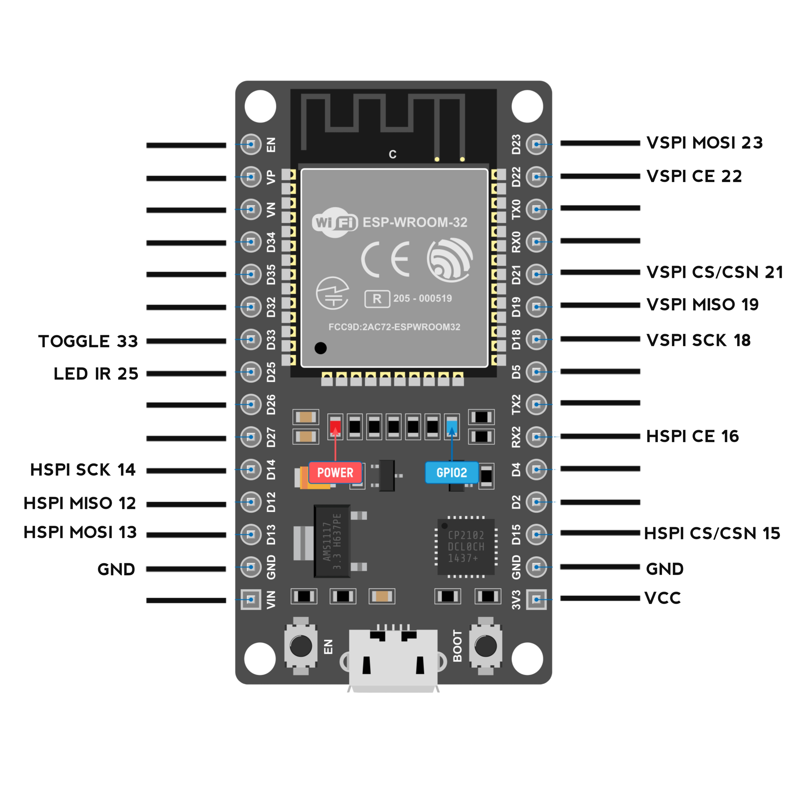

---

# 🚀 Alat Jamming Wireless & Remote TV IR


## 🎯 Apa Itu Proyek Ini?

Simpelnya, ini alat serba bisa pakai ESP32. Ada dua fungsi utama:

1. **Ngacak sinyal WiFi & Bluetooth** pake 2 modul RF → cocok buat uji coba jamming.
2. **Ngirim sinyal remote TV universal** via LED infrared → tinggal arahkan ke TV, dan... cling!

Cocok buat belajar, eksperimen, atau gantiin remote TV yang suka ilang. 😄

---

## 🧰 Apa Aja yang Diperlukan?

### 🔩 Komponen yang Dipakai

- ESP32 Dev Board (rekomendasi: ESP32-WROOM-32)
- 2x Modul NRF24L01+ (2.4GHz transceiver)
- LED IR (misal: KY-005)
- 2x Resistor 100µF atau 10µF
- 1x Push Button
- Breadboard atau PCB
- Power supply (baterai LiPo atau USB)
- Kabel jumper secukupnya

---

## 🔌 Skema Rangkaian

### 📌 Koneksi NRF24L01+ ke ESP32

#### Modul #1 (VSPI - default SPI)
| NRF24L01+ | ESP32 |
|-----------|--------|
| CE        | GPIO16 |
| CSN       | GPIO15 |
| SCK       | GPIO14 |
| MISO      | GPIO12 |
| MOSI      | GPIO13 |

#### Modul #2 (HSPI - alternatif SPI)
| NRF24L01+ | ESP32 |
|-----------|--------|
| CE        | GPIO22 |
| CSN       | GPIO21 |
| SCK       | GPIO18 |
| MISO      | GPIO19 |
| MOSI      | GPIO23 |

### Komponen Lain
| Komponen       | ESP32     |
|----------------|-----------|
| LED IR         | GPIO25    |
| Tombol TOGGLE  | GPIO33    |

📸 **Skema lengkap:**



---

## 💻 Persiapan di Sisi Software

### 📚 Library Wajib

- `RF24`
- `SPI`
- `ezButton`
- `IRremote`
- `tvbgone_codes.h` (udah include di repo ini)

### 🔧 Langkah Instalasi

1. Download Arduino IDE → [arduino.cc](https://www.arduino.cc/en/software)
2. Tambah dukungan board ESP32:
   - Buka **File > Preferences**
   - Tambahkan URL ini di bagian *Additional Board URLs*:  
     ```
     https://raw.githubusercontent.com/espressif/arduino-esp32/gh-pages/package_esp32_index.json
     ```
   - Buka **Tools > Board > Boards Manager** → cari **ESP32** → install.
   - **Note**:  pilih yang versi 2.0.7 atau versi sebelumnya misal 1.0.6
3. Install library lewat Library Manager:
   - `RF24`, `ezButton`, `IRremote`

4. Ambil file `tvbgone_codes.h` dari folder proyek ini.

5. Copy-paste kode utamanya ke Arduino IDE.

6. Pilih board & port:
   - Board: `ESP32 Dev Module`
   - Port: pilih yang sesuai

7. Upload, dan selesai!

🔁 **Alternatif gampang**: langsung flash via web di sini:  
👉 [https://harissfx.github.io/Blue-Jamming-Tv-Gone/](https://harissfx.github.io/Blue-Jamming-Tv-Gone/)

---

## 🕹️ Cara Pakai

### 🎛️ Tombol & Indikator

- **BOOT (GPIO0)** → Ganti mode: Jamming ↔ IR Send
- **TOGGLE (GPIO33)** → Start/Stop fungsi aktif
- **LED Status**:
  - 🔵 Kedip lambat: Standby
  - 🔴 Nyala terus: Lagi Jamming
  - 🟡 Kedip cepat: Lagi kirim IR

---

### 🔄 Mode Operasi

#### 1. 🔊 Mode Jamming

- Kirim sinyal "acak" di 2.4GHz lewat 2 modul RF
- Gunain teknik frequency hopping
- Cocok buat simulasi gangguan WiFi & Bluetooth

**Cara pakai:**
- Nyalain alat (default-nya langsung masuk mode ini)
- Tekan TOGGLE buat mulai/berhenti

#### 2. 📺 Mode IR Remote

- Kirim sinyal power ke berbagai merek TV (universal remote)
- Mirip fungsi TV-B-Gone

**Cara pakai:**
- Tekan BOOT buat pindah ke mode IR
- Arahkan LED IR ke TV
- Tekan TOGGLE buat mulai kirim sinyal
- Tekan TOGGLE lagi buat berhenti

---

## ⚙️ Info Teknis

### 💥 Jamming Details
- Gunain 2 modul NRF24L01+ sekaligus
- Dipisah pakai 2 channel SPI (HSPI & VSPI)
- Efektif buat uji coba teknik jamming low-level

### 🔦 IR Remote
- Kode IR udah disiapin buat banyak merk TV
- Tetap responsif karena nggak pake `delay()` blocking

---

## ⚠️ Penting: Peringatan!

> **Alat ini hanya untuk edukasi & eksperimen.**

Di beberapa negara, **jamming sinyal itu ilegal atau diawasi ketat**. Harap gunakan secara bertanggung jawab. Jangan dipakai buat ganggu komunikasi penting atau perangkat orang lain. 🙏

---

## 🛠️ Masalah Umum & Solusinya

1. **Jamming nggak terasa efeknya?**
   - Cek kabel NRF24L01+
   - Pastikan power cukup (pakai kapasitor kalau perlu)
   - Coba dekatin ke target

2. **IR nggak ngaruh ke TV?**
   - Arahkan LED langsung ke sensor TV
   - Pastikan gak ada penghalang
   - Coba ubah sudut & jarak

3. **ESP32 nggak respon?**
   - Cek koneksi & tombol
   - Coba reset dan upload ulang
   - Periksa pasokan daya

---

## 📈 Rencana Pengembangan

- Kontrol lewat HP (Bluetooth)
- Pilihan jamming frekuensi tertentu
- Tambahin layar OLED/TFT buat info status
- Desain casing 3D print

---

## ☕ Dukung Proyek Ini

Kalau kamu suka dengan alat ini, bisa bantu kembangin proyek selanjutnya lewat:

👉 **Saweria:** [https://saweria.co/HarisSfx](https://saweria.co/HarisSfx)

Bantu secuil pun sangat berarti buat terus bikin alat-alat seru lainnya. Makasih banyak, ya! ❤️

---

## 👤 Kredit

**Dibuat oleh:** Haris SFX  
**Lisensi:** MIT License  

> *Semua konten dibuat untuk tujuan edukasi. Penggunaan di luar tanggung jawab pembuat.*

---
